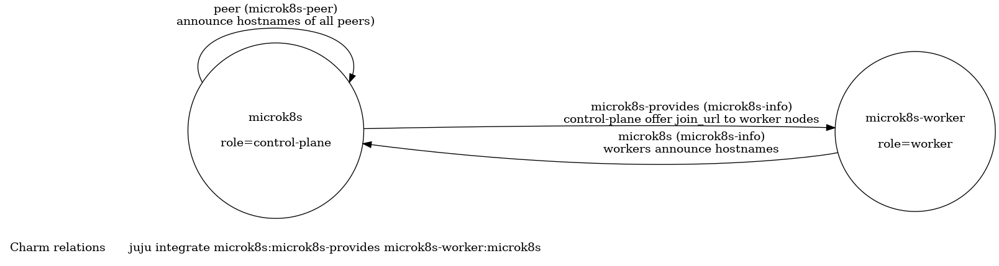

## MicroK8s Charm

### Overview

```bash
# deploy 3 control plane nodes, 3 worker nodes
juju deploy microk8s -n 3
juju deploy microk8s microk8s-worker -n 3 --config role=worker

# connect worker nodes to the control plane
juju relate microk8s:microk8s-provides microk8s-worker:microk8s
```

The control plane nodes will automatically form a 3-node cluster. The worker nodes will stay in a waiting state until they are related to the control plane.

### State

| Charm Role | State       | Value                                          | Description                                                                                                                 |
| ---------- | ----------- | ---------------------------------------------- | --------------------------------------------------------------------------------------------------------------------------- |
| all        | `role`      | `""`, `"control-plane"` or `"worker"`          | set to `config["role"]` when the charm is deployed, to prevent the role from changing afterwards                            |
| all        | `installed` | `true` or `false`                              | set to `true` after MicroK8s is installed                                                                                   |
| all        | `joined`    | `true` or `false`                              | set to `true` after joining the cluster successfully                                                                        |
| all        | `hostnames` | `{"microk8s/0": "juju-roasted-beef42-0", ...}` | mapping of unit names to hostnames. recorded by all control plane nodes and used to remove departing nodes from the cluster |

### Relations



| Charm Role    | Relation          | Interface     | Description                                                             | Application Data                                                      | Unit Data        |
| ------------- | ----------------- | ------------- | ----------------------------------------------------------------------- | --------------------------------------------------------------------- | ---------------- |
| control-plane | peer              | microk8s-peer | Offer join url to peer control plane nodes and store clustering actions | write `join_url`, `remove_nodes` (leader), read `join_url` (follower) | write `hostname` |
| worker        | peer              | microk8s-peer | Unused                                                                  |                                                                       |                  |
| control-plane | microk8s-provides | microk8s-info | Offer join url to worker nodes                                          | write `join_url`                                                      | read `hostname`  |
| worker        | microk8s          | microk8s-info | Retrieve join url from control plane                                    | read `join_url`                                                       | write `hostname` |

### Clustering

#### Control Plane

When deploying the charm with `role=""` or `role="control-plane"`, the charm will bootstrap a control plane and automatically cluster all peers. The state machine implemented by the charm is shown in the figure below:


- The leader unit generates and shares a `join_url` for joining other (control plane or worker) nodes to the cluster. The join_url is shared using the `peer` (follower units) and `microk8s-provides` (worker units) relations.
- All control plane units announce their hostname through the `peer` relation.
- The leader unit takes care of removing nodes (using `microk8s remove-node --force`) after they have left the cluster.

#### Worker

When deploying the charm with `role="worker"`, the charm will deploy worker-only nodes. The nodes will wait for a `microk8s` relation to an existing microk8s control plane application.


### Source

The source code is in the `src/` folder and the tests are in `tests/`. The code structure is as follows:

```yaml
charm-microk8s:                     # Root directory
- charmcraft.yaml                   # Charm charmcraft.yaml file
- config.yaml                       # Defines charm configuration options
- metadata.yaml                     # Charm metadata.yaml file
- lxd-profile.yaml                  # LXD profile for the charm to work on LXD
- tox.ini                           # CI and development tooling
- docs:
  - architecture.md                 # Document architecture decisions for the charm
  - development.md                  # Getting started with developing the charm and running tests
- lib:
  - charms/grafana_agent/v0:
    - cos_agent.py                  # Library for COS integration (updated by src/hack/update_libs.py)
- src:
  - deploy: [...]                   # Kubernetes manifests deployed by the charm
  - grafana_dashboards: [...]       # Grafana Dashboards for COS integration (updated by src/hack/update_dashboards.py)
  - hack:
    - update_alert_rules.py         # Update 'src/prometheus alert rules' from upstream sources
    - update_dashboards.py          # Update 'src/grafana_dashboards' from upstream sources
    - update_kube_state_metrics.py  # Update 'src/deploy/kube-state-metrics.yaml' from upstream sources
    - update_libs.py                # Update charmcraft libraries under 'lib' from upstream sources
  - prometheus_alert_rules: [...]   # Prometheus Alert Rules for COS integration (updated by src/hack/update_alert_rules.py)
  - charm_config.py                 # Channel-specific charm configuration
  - charm.py                        # Main charm source code and entry point
  - containerd.py                   # Implement containerd functionality
  - metrics.py                      # Implement observability related functionality
  - microk8s.py                     # Implement microk8s functionality
  - ops_helpers.py                  # Helpers and utilities not available yet in ops framework
  - util.py                         # Implement helpers and utilities
- tests:
  - unit:
    - conftest.py                   # Shared test fixtures
    - test_charm_control_plane.py   # Unit tests for src/charm.py (control plane specific)
    - test_charm_worker.py          # Unit tests for src/charm.py (worker specific)
    - test_charm.py                 # Unit tests for src/charm.py
    - test_containerd.py            # Unit tests for src/containerd.py
    - test_metrics.py               # Unit tests for src/metrics.py
    - test_microk8s.py              # Unit tests for src/microk8s.py
    - test_ops_helpers.py           # Unit tests for src/util.py
    - test_util.py                  # Unit tests for src/util.py
  - integration:
    - conftest.py                   # Shared test fixtures for integration tests
    - config.py                     # Integration tests configuration file
    - test_microk8s.py              # Integration tests (clustering)
    - test_metallb_traefik.py       # Integration tests (MetalLB and Traefik LoadBalancer)
    - test_observability.py         # Integration tests (grafana-agent)
```
